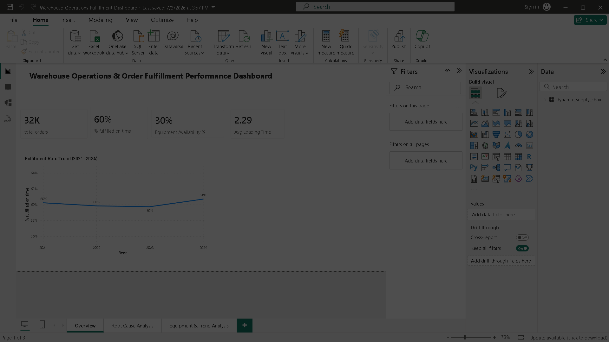

# Warehouse Operations & Order Fulfillment Performance Dashboard

An interactive Power BI dashboard analyzing warehouse operations, order fulfillment performance, and equipment-related delays using DAX and Power Query — helping identify root causes behind fulfillment delays and equipment downtime.

## 📊 Dataset
- **Source:** Dynamic Supply Chain Logistics Dataset
- **Fields:** Order volume, fulfillment status, equipment availability, congestion category, warehouse inventory levels, loading times

## 🛠️ Tools Used
- Power BI Desktop (data modeling, visualization)
- Power Query (data cleaning and transformation)
- DAX (KPI measures, trend calculations)

## 📈 Key Findings
1. **Fulfillment performance:** Out of 32K total orders, only 60% were fulfilled on time — indicating significant room for operational improvement.
2. **Equipment availability is a major bottleneck:** Equipment availability sits at just 30%, directly correlating with delayed fulfillment rates.
3. **Congestion doesn't significantly change outcomes:** % fulfilled on time is roughly consistent (~60%) across Low, Medium, and High congestion categories — suggesting congestion alone isn't the primary delay driver; equipment and process factors matter more.
4. **Fulfillment trend is flat:** From 2021-2024, on-time fulfillment rate hovered consistently around 60-61%, showing no major improvement over time despite likely process changes.
5. **Delay rate spikes seasonally:** Monthly delay rate data shows sharp spikes (e.g., a peak of 0.416 in one month), suggesting seasonal or demand-driven strain on warehouse operations.

## 📁 Dashboard Pages
1. **Overview** — KPI summary cards (total orders, % fulfilled on time, equipment availability, avg loading time) and fulfillment rate trend (2021-2024).
2. **Root Cause Analysis** — Fulfillment rate with vs. without equipment, and % fulfilled on time by congestion category.
3. **Equipment & Trend Analysis** — Warehouse inventory level trend, delay rate by month, and average delay probability by equipment status.

## 🖼️ Screenshots

### Overview

### Root Cause Analysis

### Equipment & Trend Analysis

## 📬 Contact
Built by Maneesh as part of a Power BI portfolio project for data analyst roles.
